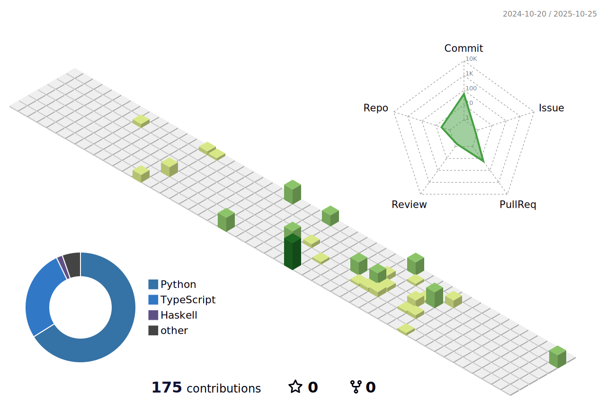

<div align="center">
  
</div>

###

<div align="center">
  <a href="https://www.linkedin.com/in/synvus/" target="_blank">
    
  </a>
  <a href="https://discord.com/channels/@synvus" target="_blank">
    
  </a>
</div>

##

<h3 align="left">About Me</h3>

###

<p align="left">- MSc Software Engineering @ University of Amsterdam<br>- BSc Computer Science @ University of Groningen

###

<h3 align="left">Tech Stack</h3>

###

<div align="left">
  
  
  
  
  
  
  
  
  
  
  
  
  
  
  
  
  
  
  
  
  
  
  
  
  
  
  
  
  
  
  
  
  
  
  
  
  
  
  
</div>

###

<h3 align="left">My Stats</h3>

###

<div align="center">
  
</div>

###

<div align="center">
  
</div>

###


###



###

<!--START_SECTION:waka-->


**🐱 My GitHub Data** 

> 📦 150.0 kB Used in GitHub's Storage 
 > 
> 🏆 48 Contributions in the Year 2024
 > 
> 🚫 Not Opted to Hire
 > 
> 📜 20 Public Repositories 
 > 
> 🔑 26 Private Repositories 
 > 
**I'm a Night 🦉** 

```text
🌞 Morning                58 commits          ██░░░░░░░░░░░░░░░░░░░░░░░   07.83 % 
🌆 Daytime                292 commits         ██████████░░░░░░░░░░░░░░░   39.41 % 
🌃 Evening                288 commits         ██████████░░░░░░░░░░░░░░░   38.87 % 
🌙 Night                  103 commits         ███░░░░░░░░░░░░░░░░░░░░░░   13.90 % 
```
📅 **I'm Most Productive on Wednesday** 

```text
Monday                   93 commits          ███░░░░░░░░░░░░░░░░░░░░░░   12.55 % 
Tuesday                  117 commits         ████░░░░░░░░░░░░░░░░░░░░░   15.79 % 
Wednesday                139 commits         █████░░░░░░░░░░░░░░░░░░░░   18.76 % 
Thursday                 87 commits          ███░░░░░░░░░░░░░░░░░░░░░░   11.74 % 
Friday                   99 commits          ███░░░░░░░░░░░░░░░░░░░░░░   13.36 % 
Saturday                 89 commits          ███░░░░░░░░░░░░░░░░░░░░░░   12.01 % 
Sunday                   117 commits         ████░░░░░░░░░░░░░░░░░░░░░   15.79 % 
```


📊 **This Week I Spent My Time On** 

```text
🕑︎ Time Zone: Europe/Amsterdam

💬 Programming Languages: 
No Activity Tracked This Week

🔥 Editors: 
No Activity Tracked This Week

🐱‍💻 Projects: 
No Activity Tracked This Week

💻 Operating System: 
No Activity Tracked This Week
```

**I Mostly Code in JavaScript** 

```text
JavaScript               18 repos            ██████████░░░░░░░░░░░░░░░   40.00 % 
Python                   14 repos            ████████░░░░░░░░░░░░░░░░░   31.11 % 
Java                     5 repos             ███░░░░░░░░░░░░░░░░░░░░░░   11.11 % 
Haskell                  2 repos             █░░░░░░░░░░░░░░░░░░░░░░░░   04.44 % 
HCL                      1 repo              █░░░░░░░░░░░░░░░░░░░░░░░░   02.22 % 
```


**Timeline**


 Last Updated on 03/03/2024 11:05:53 UTC
<!--END_SECTION:waka-->
